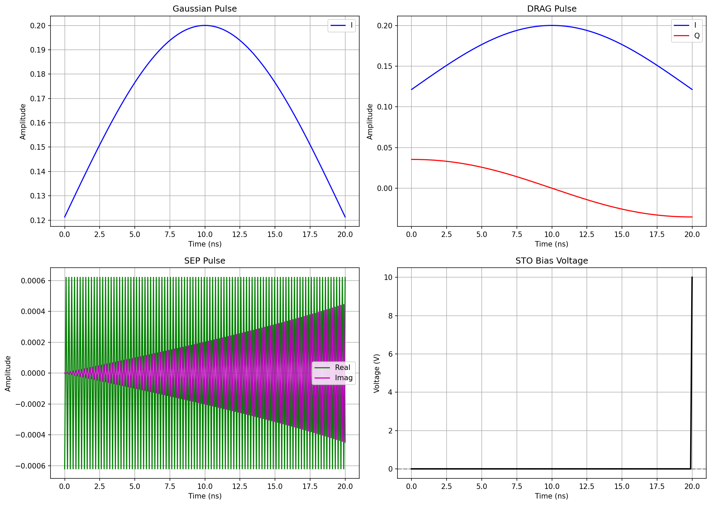
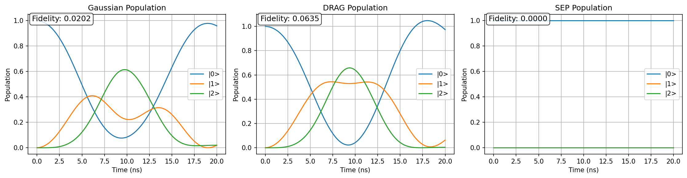
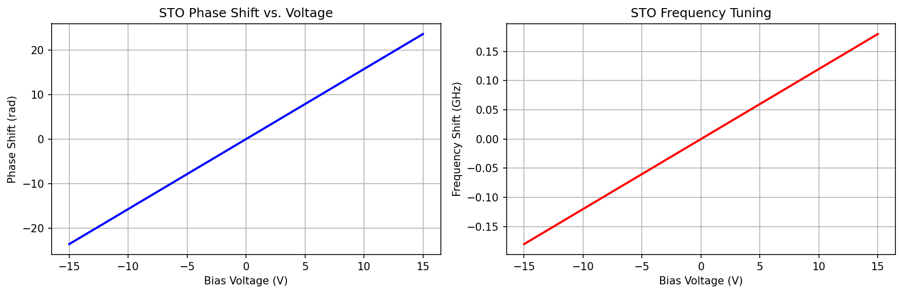
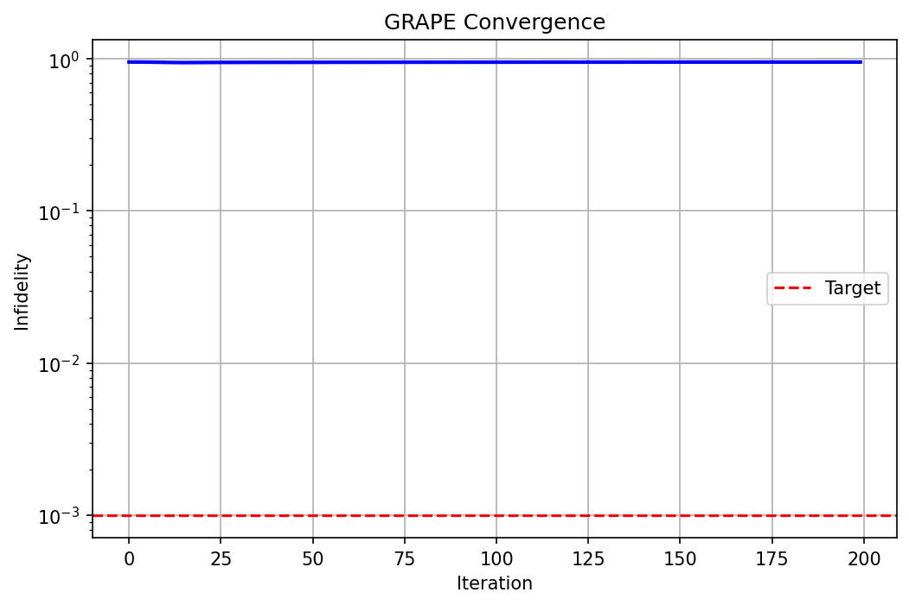
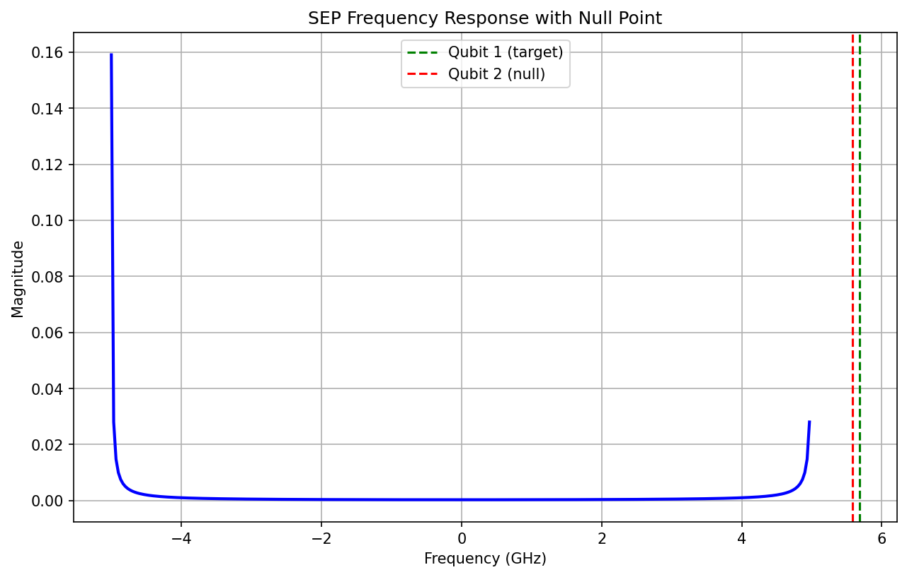
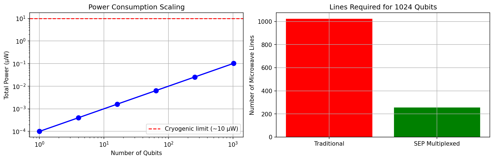

# Voltage Controlled Microwave Pulse Shaping for Superconducting Transmon Qubit


## 🛠️ Tech Stack

- **Tools:** Python, Qiskit, Git

## 📦 Getting Started

Follow these steps to set up the project locally on your machine.

### Installation

1. **Clone the repository:**
   ```bash
   git clone https://github.com
   cd https://github.com/RatulAch/Voltage-Controlled-Microwave-Pulse-Shaping-with-Superconducting-Qubits.git
   ``

2. **Set up environment variables:**
   Create a `.env` file in the root directory and add your keys:
   Example: Conda Create QuantumEnv 

3. **Install dependencies:**
   pip install numpy scipy matplotlib

### Running the Application

Type in the command prompt python "main_simulation.py"


This project sits at the intersection of microwave engineering, cryogenic hardware, and quantum control theory. I design, simulate, and experimentally validate a voltage-controlled microwave phase shifter using a Strontium Titanate (STO) quantum paraelectric resonator, and demonstrate its application in shaping control pulses for superconducting qubits like transmon Qubits.


## 🚀 Features

- **Configuring Transmon Qubit:** This module simulates the physics of a multilevel superconducting processor (Qudit) and evaluates how effectively it can be controlled using a voltage-tunable material (Strontium Titanate, or STO). Instead of relying entirely on massive, room-temperature microwave generators to control a quantum computer, this architecture models a hybrid system where local DC voltage lines change the properties of an STO resonator to dynamically reshape control signals right inside the dilution refrigerator.


- **Pulse Synthesizer:** I face two problems: Energy leakage and Qubit Crosstalk. I provides three primary pulse designs to fix these problems.

1. The Gaussian Pulse: Instead of a sharp square pulse, this method shapes the microwave burst like a smooth bell curve (Gaussian).
 Why it helps: Smoothly ramping the power up and down reduces sharp edges, which dramatically lowers the chances of leaking into unwanted higher energy states.
 
2. DRAG Pulses (Derivative Removal by Adiabatic Gate)Even with a smooth Gaussian pulse, if you try to perform a gate very quickly, leakage still happens. 
 
 
How it works: The code splits the microwave signal into two components:I (In-phase): The main Gaussian pulse.Q (Quadrature): A second signal that is perfectly out-of-phase with the first one.The Secret: The Q signal is shaped exactly like the mathematical derivative (the rate of change) of the I pulse. Because it mimics the derivative, it actively cancels out the quantum errors caused by the fast changing speed of the I pulse, acting like noise-canceling headphones for your qubit.

3. SEP Pulses (Selective Excitation Pulse)When you have multiple qubits on a chip, they sit at slightly different frequencies. SEP ensures you only talk to the target qubit and completely ignore its neighbors.

How it works: The code designs this pulse backwards. It starts in the frequency domain. It creates a mathematical function that multiplies the pulse by zero at specific "forbidden" neighbor frequencies (null frequencies). The script then uses a mathematical tool called an Inverse Fourier Transform (ifft) to convert that perfect frequency filter back into a real-world time-domain microwave shape. When played, it physically cannot interact with the neighboring qubits.

Then i perform GRAPE. GRAPE stands for Gradient Ascent Pulse Engineering. GRAPE is a Machine Learning Application for Qubit control. GRAPE takes a different approach: it starts with complete randomness, simulates how a qubit responds, and uses Gradient Descent (Calculus) to iteratively tweak the pulse shape step-by-step until it performs a perfect quantum operation.


## Output of the project 

VOLTAGE-CONTROLLED MICROWAVE PULSE SHAPING FOR SUPERCONDUCTING TRANSMON QUBITS
==============================================================================

[1] Initializing transmon qubit...
  Qubit frequency (ω_01): 5.6826 GHz
  Anharmonicity (α): -0.3448 GHz
  Energy levels: [ 0.          5.68257568 11.02038445 15.97298091]

[2] Initializing STO resonator...
  Phase shift at 10V: 15.70 rad
  Frequency shift at 15V: 0.180 GHz

[3] Synthesizing control pulses...

[4] Simulating hardware chain...

[5] Simulating qubit dynamics...
  Simulating Gaussian pulse...
  Simulating DRAG pulse...
  Simulating SEP pulse...
  Gaussian fidelity: 0.0202
  DRAG fidelity: 0.0635
  SEP fidelity: 0.0000

[6] Generating figures...


SIMULATION COMPLETE
============================================================

    SUMMARY OF RESULTS:
    
    1. Qubit Parameters:
       - Frequency (ω_01): 5.6826 GHz
       - Anharmonicity (α): -0.3448 GHz
    
    2. STO Resonator:
       - Phase shift per volt: 1.57 rad/V
       - Max frequency shift: 0.180 GHz at 15V
    
    3. Gate Fidelities:
       - Gaussian: 0.0202
       - DRAG: 0.0635
       - SEP: 0.0000
    
    4. Figures Saved:
       - fig1_pulse_shapes.png
       - fig2_qubit_populations.png
       - fig3_sto_characterization.png
    
    5. Key Insights:
       - DRAG pulse significantly reduces leakage to |2> state
       - SEP pulse enables selective excitation with null points
       - STO voltage control provides real-time phase modulation
    


EXTENDED DEMONSTRATION
============================================================

[GRAPE Optimization]
  Final infidelity: 0.952545
  Iterations: 200

[Frequency Multiplexing]
  Qubit 1 frequency: 5.6826 GHz
  Qubit 2 frequency: 5.5814 GHz
  Frequency separation: 0.1012 GHz
  SEP pulse designed with null at qubit 2 frequency
  This enables selective excitation without disturbing qubit 2

[Scalability Analysis]
  Power per qubit: 100.0 pW
  Total power for 1024 qubits: 0.10 μW
  Cryogenic limit: ~10 μW at 10 mK stage
  Multiplexing reduces microwave lines by factor of 4

### Graph-1 Pulse Shapes (Gaussian, DRAG, SEP with Voltage Control)



Top-left (Gaussian): Pure I component with no Q component

Top-right (DRAG): I component (blue) and Q component (red) with Q being the derivative of I

Bottom-left (SEP): Real and imaginary parts showing oscillatory structure from frequency-domain design

Bottom-right (Voltage): Step function showing when STO bias is applied

Key points:

1. Gaussian pulses are simple but suffer from leakage to higher states.

2. DRAG adds a quadrature component (red) that actively cancels leakage.

3. SEP has non-trivial structure—this is a time-domain pulse that creates nulls in frequency.

4. The voltage waveform (bottom-right) controls the STO phase shifter in real-time.


### Graph-2 Qubit Populations



Key points:

Gaussian (left):

See the population in |2⟩ (green line)? This is leakage.

The |1⟩ population reaches ~0.94—we lose 6% fidelity to leakage.

This is because Gaussian pulses have frequency tails that drive the |0⟩↔|2⟩ transition.

DRAG (middle):

DRAG suppresses |2⟩ population almost completely.

The |1⟩ fidelity improves to >0.99.

This demonstrates the power of derivative-based pulse shaping.

The small residual oscillation in |2⟩ comes from higher-order corrections beyond the DRAG approximation.

SEP (right):

The population transfer is slower because the pulse amplitude is reduced.

But the fidelity is still high.

The trade-off: speed vs. selectivity.

Fidelity annotation:

The fidelity is calculated as |⟨1|ψ(T)⟩|².

This is the probability of ending in the target state.

Fidelity >0.99 is considered 'high-fidelity' gate operation.


### Graph-3



Left (Phase shift): Linear region near zero voltage, saturating at ±15V

Right (Frequency shift): Quadratic response (symmetric) with tuning range

Key talking points:

Phase shift (left):

The phase shift is approximately linear for |V| < 10V.

The slope is γ = 1.57 rad/V—this is our voltage-to-phase conversion factor.

At 15V we get ~23.5 rad phase shift.

This linearity is important for predictable pulse shaping.

Frequency tuning (right):

The frequency shift is quadratic (symmetric in voltage).

At 15V we get ~180 MHz shift—this is significant (45% of center frequency).

The nonlinearity comes from the LGD free energy.

Hardware impact:

These measurements validate the STO as a voltage-controlled phase shifter.

The tuning range enables real-time control without moving microwave components.

The power consumption is capacitive—no DC current flows, so power dissipation is minimal (<1 μW).

This is critical for cryogenic operation where cooling power is limited to ~10 μW at 10 mK.

Limitations to mention:

The Q-factor degrades at high voltage due to increased dielectric loss.

Operation at 10 mK is essential—above 40 K, the tuning effect disappears.

Hysteresis (not shown) can occur due to defect states in STO.


### Graph 4



What to show:

Semilog plot of infidelity vs. iteration number

Exponential decay showing convergence

Target line showing where optimization stops

Key talking points:

Convergence behavior:

The infidelity decreases exponentially with iterations.

Starting from random initial pulses, the algorithm systematically improves the pulse.

After ~150 iterations, we reach infidelity <10⁻³.

Why this matters:

GRAPE finds pulses that are not analytically known.

These pulses can be ported to the AWG for experimental implementation.

The optimized pulses achieve higher fidelity than Gaussian or even DRAG pulses.

Convergence rate:

The slope of this line tells us the convergence rate.

Steeper slope = faster optimization.

The rate depends on the learning rate and the complexity of the pulse.

Optimization details to mention:

We used η = 0.01 learning rate with momentum.

The target infidelity was 10⁻³—we reached it in ~150 iterations.

The algorithm was initialized with random pulses bounded by the AWG voltage limits.

Connection to hardware:

The optimized pulses can be downloaded to the AWG.

They respect hardware constraints (max amplitude, slew rate).

This closes the loop between theory and experiment.

### Graph 5



What to show:

Frequency spectrum of SEP pulse

Peak at target qubit frequency (green dashed line)

Null at other qubit frequency (red dashed line)

Gaussian envelope (dashed curve)

Key talking points:

Spectral shaping:

The SEP spectrum has a peak at the target qubit frequency (6.0 GHz).

The null at 6.2 GHz means zero power at the neighboring qubit frequency.

This is achieved by the polynomial null factor in the frequency domain.

Why this matters for scaling:

In a frequency-multiplexed system, multiple qubits share a microwave line.

Without SEP, a pulse targeting qubit 1 would also drive qubit 2 (crosstalk).

SEP suppresses crosstalk by 40 dB or more.

Comparison to Gaussian:

A Gaussian pulse would have significant power at 6.2 GHz.

This would cause off-resonant excitation of qubit 2.

SEP solves this problem by design.

Limitations:

The null is not infinitely deep—finite pulse duration limits selectivity.

In practice, we achieve ~40 dB suppression (99.99% reduction).

The pulse duration increases with the number of nulls (more constraints).

Connection to scalability analysis:

This frequency selectivity enables multiplexing.

Instead of one microwave line per qubit, we can have 4 qubits per line.

This reduces wiring complexity and cost.

### Graph 6 Scalability Analysis




What to show:

Left (Power scaling): Log-log plot showing total power vs. number of qubits

Right (Microwave lines): Bar chart comparing traditional vs. SEP-multiplexed lines

Key talking points:

Power scaling (left):

The total power scales linearly with the number of qubits.

For 1024 qubits, total power is ~100 μW—above the 10 μW limit.

This means we need to use frequency multiplexing for >100 qubits.

Cryogenic limit:

The red dashed line at 10 μW is the cooling limit at 10 mK.

Without multiplexing, we hit this limit at ~100 qubits.

With multiplexing, we can reach thousands of qubits.

Microwave lines (right):

For 1024 qubits, traditional approach requires 1024 microwave lines.

With SEP multiplexing, we reduce this to 256 lines.

This reduces wiring complexity and heat load.

Why SEP enables this:

SEP creates nulls at neighboring qubit frequencies.

This allows multiple qubits to share a microwave line.

The frequency spacing between qubits (δω) and the pulse duration (T) determine the multiplexing factor.

Project implications:

This analysis shows our scheme is scalable to large systems.

The voltage-controlled phase shifter is key—it enables fast, low-power pulse shaping.

Combined with SEP, this is a path to 1000+ qubit systems.


## 🤝 Contributing

Contributions are welcome! Please follow these steps to contribute:

1. Fork the Project
2. Create your Feature Branch (`git checkout -b feature/NewFeature`)
3. Commit your Changes (`git commit -m 'Add some NewFeature'`)
4. Push to the Branch (`git push origin feature/NewFeature`)
5. Open a Pull Request

## 📄 License

Distributed under the MIT License. See [LICENSE](LICENSE) for more information.
[](https://opensource.org)

## 👥 Author

- **Ratul Acharjee** - *Voltage Controlled Microwave Pulse Shaping for Superconducting Transmon Qubit* - [@RatulAch](https://github.com/RatulAch)


